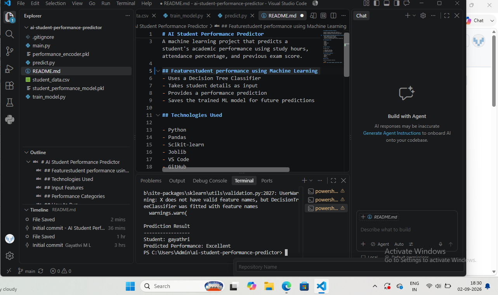

# AI Student Performance Predictor

A machine learning project that predicts a student's academic performance using study hours, attendance percentage, and previous exam score.

## Featurestudent performance using Machine Learning
- Uses a Decision Tree Classifier
- Takes student details as input
- Provides a performance prediction
- Saves the trained ML model for future predictions

## Technologies Used

- Python
- Pandas
- Scikit-learn
- Joblib
- VS Code
- GitHub

## Input Features

The model uses:

1. Study hours per day
2. Attendance percentage
3. Previous exam score

## Performance Categories

- Needs Improvement
- Average
- Good
- Excellent

## How to Run

Install the required libraries:

```bash
python -m pip install pandas scikit-learn joblib

##Project Output

##project output

